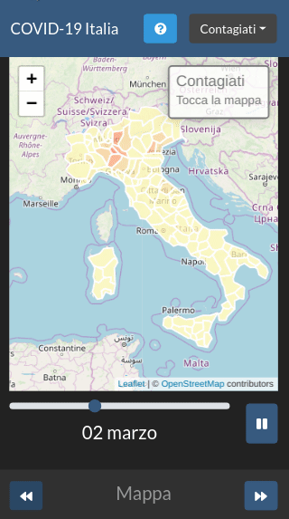
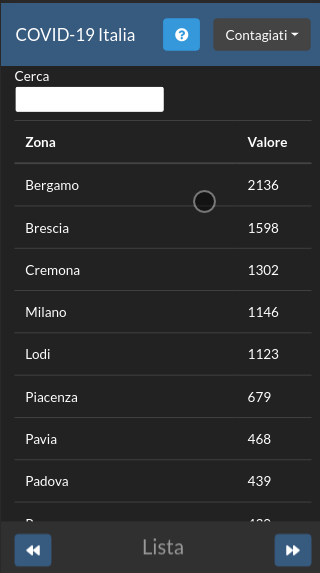
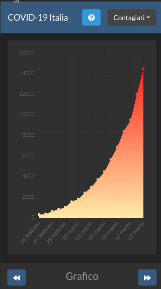

# covid-dashboard

Dashboard per la visualizzazione dei [dati forniti dalla Protezione Civile](https://github.com/pcm-dpc/COVID-19) relativi all'epidemia di COVID-19 in Italia.


|     Mappa    |   Lista |  Grafico |
:-------------------------:|:-------------------------:|:-------------------------:
  |   |   

[Disponibile qui](https://covid.galatolo.me/)


## Utilizzo

Il progetto si divide in due componenti:
* Parser (python) 
* Dashboard (html/js)

Tutto il processo di scaricamento dei dati e creazione del file della dashboard è stato automatizzato con uno script bash.

Per creare la dashboard pronta per la produzione è necessario semplicemente clonare questo repo e lanciare lo script `build.sh`

```
git clone https://github.com/galatolofederico/covid-dashboard.git
cd covid-dashboard
bash build.sh
```

Ad ogni modo per completezza è qua sotto riportata la guida per eseguire manualmente il procedimento dello script

### Parser

Il codice relativo al parser si trova nella cartella `parser`.

Per utilizzarlo occore:

Spostarsi all'interno della cartella e creare un `virtualenv`

```
cd parser
virtualenv --python=python3.6 env
```

Attivare il `virtualenv` ed installare le dipendenze

```
. ./env/bin/activate && pip install -r requirements.txt
```

Scaricare i dati della Protezione Civile
```
rm ./raw_data/*
curl https://raw.githubusercontent.com/pcm-dpc/COVID-19/master/dati-regioni/dpc-covid19-ita-regioni.csv > ./raw_data/dpc-covid19-ita-regioni.csv
curl https://raw.githubusercontent.com/pcm-dpc/COVID-19/master/dati-province/dpc-covid19-ita-province.csv > ./raw_data/dpc-covid19-ita-province.csv
```

Lanciare lo script `build.py`
```
python build.py
```

Lo script genererà nella cartella `data` i file `json` necessari alla dashboard

### Dashboard

Il codice della dashboard si trova nella cartella `dashboard`.


Per generare il codice da mandare in produzione occorre:

Copiare i file generati da `build.py` nella cartella `assets`

```
cp parser/data/*.json dashboard/assets/
```

Spostarsi all'interno della cartella `dashboard` ed installare le dipendenze con `npm`

```
cd dashboard && npm install
```

Lanciare webpack

```
npx webpack
```

Al termine i file pronti per la produzione saranno generati nella cartella `dist`


## Ridistribuire/Contribuire

La ridistribuzione del codice, integro o parziale, originale o modificato, è permessa nei limiti della licenza GNU/GPL Versione 3.

Ogni tipo di aiuto sotto qualsiasi forma è ovviamente ben accetto.